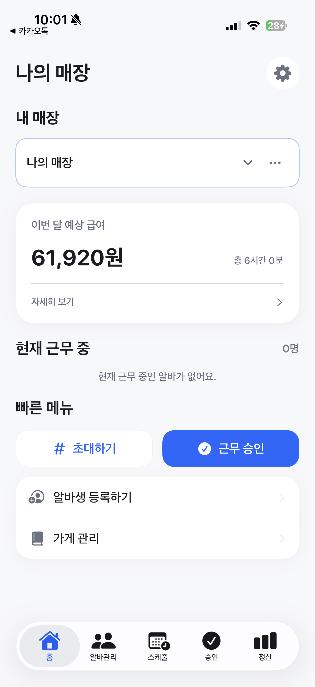
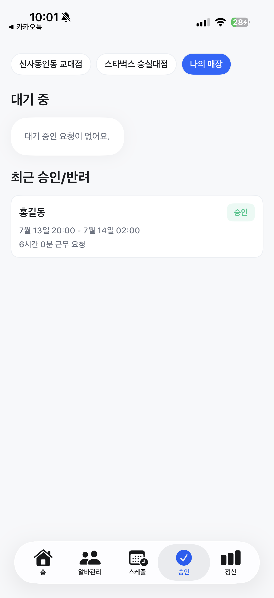
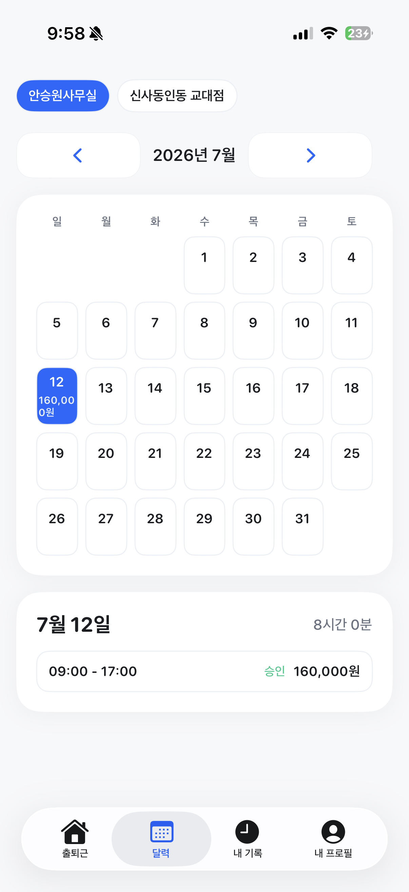
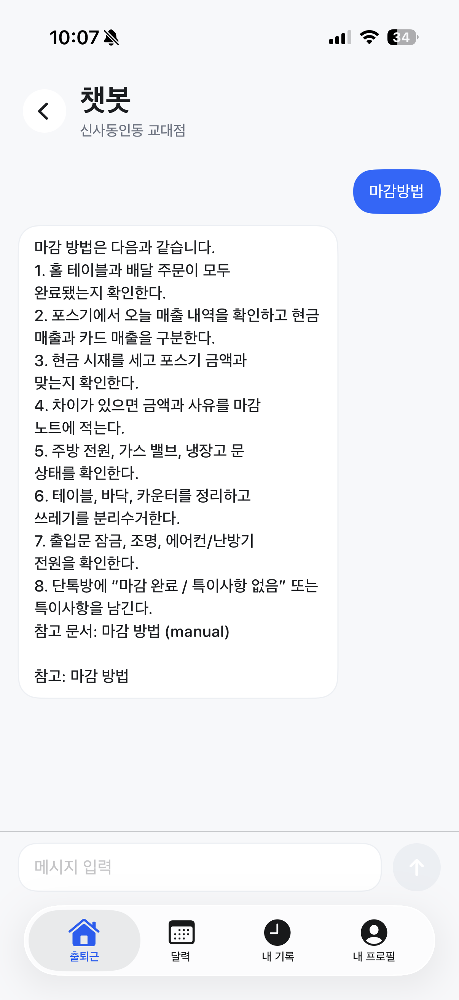
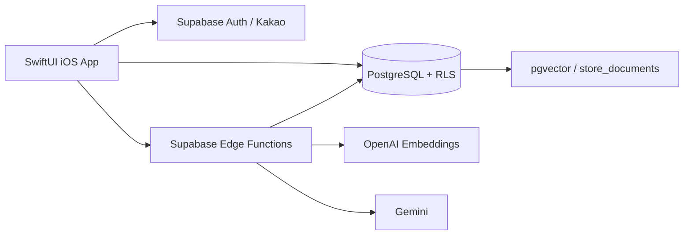

# 수당수당

소규모 사업장의 근태, 예상 급여, 운영 문서를 하나로 관리하는 iOS 앱입니다.

사장님과 알바생이 같은 근무 기록을 기준으로 승인과 정산을 진행하고, 매장별 공지와 매뉴얼은 근거 기반 챗봇으로 다시 활용합니다.

## Screens

| 사장님 홈 | 근무 승인 | 알바생 캘린더 | 매장 챗봇 |
|---|---|---|---|
|  |  |  |  |

## Project

| 항목 | 내용 |
|---|---|
| 형태 | 개인 프로젝트, iOS 앱과 Supabase 백엔드 전담 |
| 기간 | 2026.02 - 진행 중 |
| 사용자 | 소규모 매장 사장님, 알바생 |
| 현재 상태 | 핵심 사용자 흐름 구현, 급여 신뢰성 개선 진행 중 |
| iOS | Swift, SwiftUI, Swift Concurrency, ActivityKit |
| Backend | Supabase Auth, PostgreSQL, RLS, Edge Functions |
| AI | OpenAI Embeddings, pgvector, Gemini |
| 품질 상태 | 2026-07-17 Simulator 빌드 및 단위 테스트 5개 통과 |

## Problems

- 카카오톡, 메모, 종이에 흩어진 출퇴근 기록은 승인과 정산 때 다시 확인해야 합니다.
- 알바생은 급여가 어떻게 계산됐는지 알기 어렵고, 사장님은 조건 변경과 예외를 수기로 관리합니다.
- 마감 순서와 매장 공지가 단체 채팅에 묻혀 같은 질문과 답변이 반복됩니다.

## Core Flows

```text
직원 초대 -> 출퇴근 기록 -> 사장님 승인 -> 월별 근무/급여 집계
문서 등록 -> 매장별 벡터 검색 -> 근거 기반 답변 + 참고 문서
```

### Owner

- 매장 생성과 전환, 초대코드 발급, 직원 등록
- 스케줄 관리, 근무 요청 승인/반려, 월별 정산 조회
- 공지와 매뉴얼 등록, 수정, 삭제 및 챗봇 검색 확인

### Worker

- 초대코드로 매장 합류, 여러 근무지 전환
- 출근/퇴근 기록, 승인 상태와 월별 내역 조회
- 매장 공지/매뉴얼 열람, 문서 근거 챗봇 질의

## Engineering Decisions

### 1. `store_id` + RLS 기반 데이터 격리

매장 단위 데이터가 섞이면 급여와 운영 문서 모두 신뢰할 수 없습니다. 주요 테이블을 `store_id`로 연결하고, 소유 매장과 소속 매장을 기준으로 PostgreSQL RLS 정책을 분리했습니다. 앱의 필터만 신뢰하지 않고 DB를 최종 권한 경계로 사용합니다. [상세 문서](docs/case-studies/multi-tenant-rls.md)

### 2. KST 기준 시간 경계 통합

기기 시간대에 따라 근무일, 월별 집계, 야간 구간이 달라질 수 있었습니다. `AppTime`에 `Asia/Seoul` 캘린더와 ISO 파서를 모으고 시간 경계 계산이 이를 사용하도록 정리했습니다. 포매터 캐시로 반복 생성 비용도 줄였습니다. [ADR](docs/adr/0001-kst-time-boundary.md)

### 3. 캐시와 새로고침 일관성

화면 진입은 120초 TTL로 불필요한 재조회를 줄이되, 사용자가 당겨서 새로고침하면 캐시를 우회합니다. 매장·직원·월을 포함한 조회 키와 최신 요청 토큰을 함께 검증해 늦게 도착한 이전 응답이 현재 화면을 덮지 않도록 했습니다. [ADR](docs/adr/0003-refresh-consistency.md)

### 4. 매장 문서를 활용하는 RAG

범용 챗봇은 매장별 규칙을 알 수 없습니다. Edge Function이 문서를 임베딩하고 `store_id`로 제한된 pgvector 검색 결과만 Gemini에 전달합니다. 답변에는 참고 문서 메타데이터를 함께 반환하며, 관련 문서가 없으면 추측하지 않습니다. [상세 문서](docs/case-studies/rag-pipeline.md)

## Architecture



## Quality And Verification

- 중복 출근 방지: `(store_id, worker_id)`의 열린 근무 기록에 부분 유니크 인덱스 적용
- 시간 무결성: 퇴근 시간이 출근 시간보다 빠를 수 없도록 DB 제약 적용
- 권한 경계: 사장님과 알바생의 RLS 정책과 화면을 역할별로 분리
- 빌드: generic iOS 대상 서명 없는 Debug `xcodebuild` 성공
- 테스트: 급여 스냅샷·야간수당·최신 요청 검증 단위 테스트 5개 통과
- 보안: 커스텀 접근 토큰은 Keychain에 저장하고 기존 평문 토큰을 자동 마이그레이션
- 잔여 경고: 구식 SwiftUI `onChange` API를 새 형식으로 이전할 필요가 있음

### Known Limitations

급여 기능은 현재 **참고용 예상치**입니다. 2026-07-15 코드 감사에서 소득 구분과 세금/4대보험 모델, 과거 근로조건 스냅샷, 주휴수당 판정, 최저임금 검증, 화면별 합계 불일치를 확인했습니다. 오류를 숨기기보다 재현 가능한 개선 과제로 관리하고 있습니다.

- [급여 신뢰성 개선 사례](docs/case-studies/payroll-reliability.md)
- [급여 정확성 감사 로그](docs/devlog/2026-07-15-payroll-accuracy-audit.md)
- [근로조건/급여 스냅샷 제안](docs/adr/0002-payroll-snapshot.md)

## Roadmap

- 소득 구분, 근로소득세, 사회보험을 독립 축으로 재설계
- 유효기간 근로조건과 승인 급여 스냅샷 도입
- 주휴수당 판정 재설계와 급여 계산 단위 테스트 추가
- RLS 통합 테스트와 RAG 평가 질문 세트 구축

전체 계획은 [ROADMAP.md](ROADMAP.md), 사용자 관점 변경 이력은 [CHANGELOG.md](CHANGELOG.md)에서 관리합니다.

## Run Locally

1. Xcode에서 `오늘얼마?/오늘얼마?.xcodeproj`를 엽니다.
2. `Config/Secrets.xcconfig`에 Supabase와 Kakao 로컬 설정을 추가합니다.
3. Supabase migration과 Edge Function secret을 적용합니다.
4. iOS Simulator 또는 실제 기기에서 실행합니다.

```bash
supabase db push
supabase secrets set --env-file Config/.env
supabase functions deploy store-rag
```

```bash
xcodebuild \
  -project './오늘얼마?/오늘얼마?.xcodeproj' \
  -scheme '오늘얼마?' \
  -destination 'generic/platform=iOS Simulator' \
  -derivedDataPath /private/tmp/howmuchtoday-dd \
  build
```

## Documentation

- [개발 과정](docs/development_process.md)
- [기술 스택과 선택 근거](docs/tech_stack.md)
- [DB 스키마 요약](docs/schema_summary.md)
- [API 호출 규칙](docs/api_rules.md)
